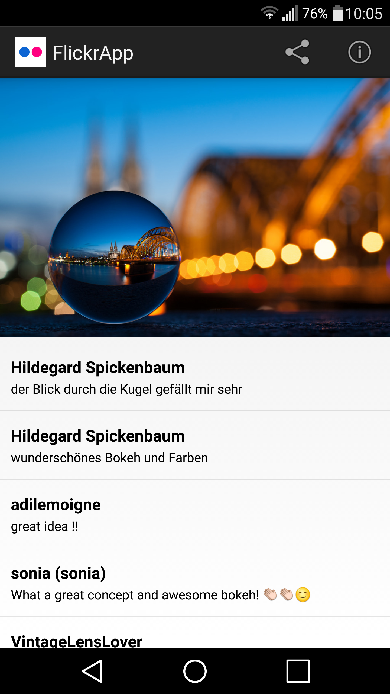
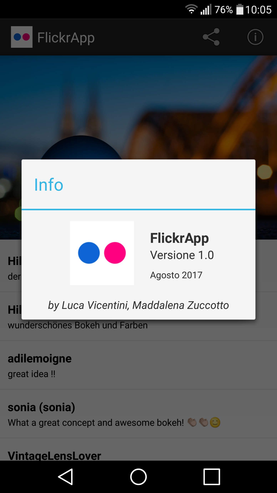

FlickrApp
===================================

Progetto di Verifica Automatica.

Specifiche del progetto
------------

Il progetto consiste nella realizzazione di un client Flickr che deve permettere di effettuare le seguenti operazioni:

- ricerca delle immagini per chiave (stringa)
- ricerca delle ultime immagini caricate
- ricerca delle immagini più popolari

In ogni caso, il risultato dovrà essere la visualizzazione di una lista di titoli di immagini, con alla loro sinistra una preview dell'immagine (75x75 pixel).
Ciascun elemento della lista dovrà reagire ai seguenti eventi:

- click semplice: si dovrà visualizzare l'immagine ad alta risoluzione, con sotto gli ultimi commenti inseriti per quell'immagine
- click lungo: si aprirà un menu contestuale che permetterà di effettuare le seguenti due operazioni:
	- condividere l'immagine ad alta risoluzione con altre app disponibili alla condivisione (es: WhatsApp, Telegram, Gmail)
	- cercare le ultime immagini caricate dallo stesso autore

La funzione di condivisione di un'immagine dovrà essere accessibile anche da menu nell'action bar, se si sta già visualizzando l'immagine ad alta risoluzione.

Il layout dovrà essere responsive, usando un approccio stile master/detail. Su un telefono si visualizzeranno alternativamente i frammenti per ricerca, lista delle immagini e singola immagine ad alta risoluzione. Su un tablet, il frammento della ricerca dovrà essere sempre visibile, mentre i frammenti della lista delle immagini e della singola immagine ad alta risoluzione dovranno essere mostrati in alternativa fra di loro.

Il menu dell'applicazione, oltre alla condivisione dell'immagine attualmente mostrata, deve includere una voce per mostrare data, versione e autore dell'applicazione.

Si utilizzi il paradigma MVC.

Screenshots
-------------

   

Scelte Implementative
-------------

- Salvataggio immagine FHD, per la condivisione, eseguito nella cartella file:///storage/emulated/0/FlickrApp/XXXXXXXX.png
- Per evitare ricaricamenti inutili e a volte lenti, abbiamo scelto di memorizzare all'interno dell'oggetto ImgInfo anche l'immagine FHD in Bitmap.
- Data la similarità delle sezioni SearchResultsFragment e SearchResultsAuthorFragment abbiamo scelto di rendere SearchResultsAuthorFragment sottoclasse di SearchResultsFragment così da ereditarne i metodi.
- Si è scelto di disabilitare i pulsanti di ricerca fino al completamento di tutte le Intent Services, utilizzate per scaricare le immagini risultato.

Autori
-------------

Luca Vicentini, Maddalena Zuccotto
